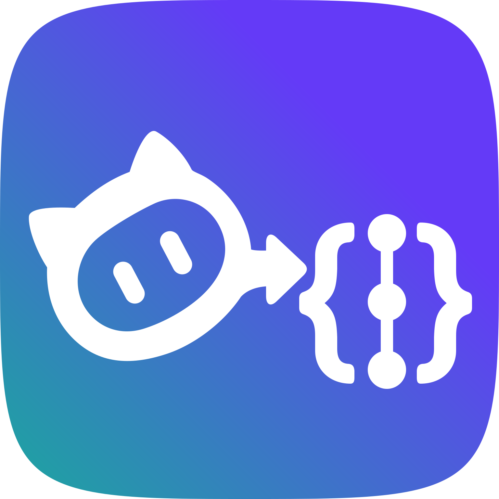

<h1 align="center">
  <br />
  CodeBuddy2API
</h1>

<p align="center">
  将 CodeBuddy 上游服务封装为 OpenAI Chat Completions 兼容接口，并提供多用户管理台、API Key、上游凭证隔离和自动轮换能力。
</p>

<p align="center">
  <a href="#本地运行">本地运行</a> ·
  <a href="#docker-部署">Docker 部署</a> ·
  <a href="#开始使用">开始使用</a>
</p>

> [!WARNING]
> 本仓库代码通过 AI 生成，未经过严格的人工代码审查或安全审计，不能保证部署环境的安全性。建议仅在本地、内网使用；如确需公网部署，建议反向代理鉴权、IP 白名单等额外保护。不建议将本服务直接暴露在公网。

## 支持协议

- `POST /openai/v1/chat/completions`：兼容 OpenAI Chat Completions，支持流式和非流式客户端请求。
- `GET /openai/v1/models`：返回当前用户可用的模型列表。
- CodeBuddy 上游只提供流式响应；非流式客户端请求由本服务聚合后返回。
- 暂未提供 Responses 等其他 OpenAI API，也未提供 Anthropic 兼容 API。

## 本地运行

### 前置要求

- Python 3.10 或更高版本；建议使用 Python 3.12
- 确保你的命令行网络可以访问 GitHub。你也可以选择手动从 [releases](https://github.com/IceeAn/codebuddy2api/releases) 页面下载 `codebuddy2api.zip`，手动解压并从命令行进入解压后的目录。

### macOS / Linux

1. 获取运行包

> 如果选择手动下载，跳过此步骤

```bash
curl -fL -o codebuddy2api.tar.gz https://github.com/iceean/codebuddy2api/releases/latest/download/codebuddy2api.tar.gz
tar -xzf codebuddy2api.tar.gz
cd codebuddy2api
```

2. 启动服务

```bash
python3 -m venv venv
source venv/bin/activate
python3 -m pip install -r requirements.txt

cp .env.example .env
mkdir -p secrets data
python3 scripts/hash_password.py admin --output secrets/users.txt

python3 web.py
```

`python3 scripts/hash_password.py admin --output secrets/users.txt` 会提示输入密码。输入并按下回车后，会将密码哈希写入 `secrets/users.txt`。重复执行并将 `admin` 改为新用户名可添加多个用户；使用已有用户名重复执行会删除旧记录并更新该用户的密码。

启动后访问 `http://127.0.0.1:8001`，继续执行 [开始使用](#开始使用)。

### Windows PowerShell

1. 获取运行包

> 如果选择手动下载，跳过此步骤

```powershell
Invoke-WebRequest `
  -Uri "https://github.com/iceean/codebuddy2api/releases/latest/download/codebuddy2api.zip" `
  -OutFile "codebuddy2api.zip"
Expand-Archive -Path "codebuddy2api.zip" -DestinationPath . -Force
Set-Location codebuddy2api
```

2. 启动服务

PowerShell 示例使用 Python Launcher `py -3`。如不可用，可以尝试将 `py -3` 替换为 `python`。

```powershell
py -3 -m venv venv
.\venv\Scripts\python.exe -m pip install -r requirements.txt

Copy-Item .env.example .env
New-Item -ItemType Directory -Force secrets | Out-Null
New-Item -ItemType Directory -Force data | Out-Null
.\venv\Scripts\python.exe scripts\hash_password.py admin --output secrets\users.txt

.\venv\Scripts\python.exe web.py
```

`.\venv\Scripts\python.exe scripts\hash_password.py admin --output secrets\users.txt` 会提示输入密码。输入并按下回车后，会将密码哈希写入 `secrets/users.txt`。重复执行并将 `admin` 改为新用户名可添加多个用户；使用已有用户名重复执行会删除旧记录并更新该用户的密码。

启动后访问 `http://127.0.0.1:8001`，继续执行 [开始使用](#开始使用)。

### 更新

本地运行更新时，下载新版 Release 包并解压到新目录，停止旧服务后，把旧目录中的 `data`、`secrets` 和 `.env` 复制或移动到新目录，再重新创建虚拟环境并执行 `python3 -m pip install -r requirements.txt` 后启动。确认新版运行正常后，再删除旧目录。

## Docker 部署

推荐用 Docker 跑正式服务。本路径只依赖 Docker 和 Docker Compose。

### 1. 获取 Compose 文件

在你准备用于保存部署文件和运行数据的目录中执行：

```bash
curl -fsSL -o docker-compose.yml https://raw.githubusercontent.com/iceean/codebuddy2api/main/docker-compose.yml
```

> 也可以从本仓库的 [docker-compose.yml](docker-compose.yml) 复制内容并手动创建 `docker-compose.yml` 文件。

### 2. 创建管理台用户

```bash
docker run --rm -it \
  -v "$PWD/secrets:/app/secrets" \
  ghcr.io/iceean/codebuddy2api:latest \
  add-user admin
```

命令会提示输入密码，并原子更新 `secrets/users.txt`。需要多个管理台用户时，重复执行并替换用户名；再次使用已有用户名会删除旧记录并更新密码。`add-user` 容器需要可写目录挂载，正式服务只读挂载该目录。

若服务已在运行，新增用户或更新密码后需要重启容器才能生效：

```bash
docker compose restart codebuddy2api
```

### 3. 启动服务

```bash
docker compose up -d
```

启动后访问 `http://127.0.0.1:8001`，继续执行 [开始使用](#开始使用)。

SQLite 与 CodeBuddy 凭证保存在当前目录的 `data` 中，系统用户保存在 `secrets/users.txt`。

若需要通过域名、服务器 IP 访问服务、配置反向代理或修改其他配置，可参考 [.env.example](.env.example) 创建 `.env` 并配置相关环境变量后再启动。

## 开始使用

服务启动后，按此顺序操作：

1. 使用刚创建的系统用户名和密码登录。
2. 在“凭证管理”中启动 CodeBuddy 认证并完成官方登录授权，也可以手动添加凭证。
3. 确认凭证列表中至少有一个有效凭证。
4. 在“API 密钥”中创建一个 `sk-...` API Key；请及时复制，明文只会在创建时展示一次。

拿到 API Key 后，可以先用 `curl` 验证：

```bash
curl "http://127.0.0.1:8001/openai/v1/chat/completions" \
  -H "Authorization: Bearer sk-your_api_key" \
  -H "Content-Type: application/json" \
  -d '{
    "model": "glm-5.2",
    "messages": [
      {"role": "user", "content": "你好，2+2 等于几？"}
    ]
  }'
```

把 `sk-your_api_key` 替换为管理台生成的 API Key。

Windows PowerShell 可用以下命令验证：

```powershell
$body = @{
  model = "glm-5.2"
  messages = @(
    @{
      role = "user"
      content = "你好，2+2 等于几？"
    }
  )
} | ConvertTo-Json -Depth 4

Invoke-RestMethod `
  -Uri "http://127.0.0.1:8001/openai/v1/chat/completions" `
  -Method Post `
  -Headers @{ Authorization = "Bearer sk-your_api_key" } `
  -ContentType "application/json" `
  -Body $body
```

## 客户端使用

兼容大部分支持允许自定义端点 URL 且支持 OpenAI Chat Completions 协议的客户端。

手动调用示例如下（须将 `sk-your_api_key` 更换为上文获取的 API Key）：

Python 示例需要另外安装 OpenAI SDK：

```bash
python3 -m pip install openai
```

```python
import openai

client = openai.OpenAI(
    api_key="sk-your_api_key",
    base_url="http://127.0.0.1:8001/openai/v1",
)

# 非流式请求
response = client.chat.completions.create(
    model="glm-5.2",
    messages=[{"role": "user", "content": "你好"}],
)
print(response.choices[0].message.content)

# 流式请求
stream = client.chat.completions.create(
    model="glm-5.2",
    messages=[{"role": "user", "content": "写一个 Python Hello World"}],
    stream=True,
)
for chunk in stream:
    print(chunk.choices[0].delta.content or "", end="")
```

## 端点与鉴权边界

| 调用方     | 路径                               | 鉴权方式                | 说明                             |
| ---------- | ---------------------------------- | ----------------------- | -------------------------------- |
| 外部客户端 | `/openai/v1/*`                     | `sk-...` Bearer API Key | 对外 OpenAI 兼容入口             |
| Web 管理台 | `/auth/*`                          | 登录接口或会话 Cookie   | 登录、恢复会话、退出             |
| Web 管理台 | `/api/admin/*`                     | 会话 Cookie             | 凭证、API Key、设置和状态管理    |
| 开发文档   | `/docs`、`/redoc`、`/openapi.json` | 会话 Cookie             | Swagger、ReDoc 与 OpenAPI schema |
| 监控系统   | `GET /health`                      | 无                      | 健康检查                         |

登录管理台后，可从“开发文档”页面的按钮在新标签页打开 `/docs`；也可以在保持登录会话的浏览器中直接访问 `/docs` 或 `/redoc`。未登录请求会返回 401，`sk-...` API Key 不能代替管理台会话访问文档。

OpenAPI 文档会展示外部 `/openai/v1/*` 的 Bearer API Key 鉴权和 Chat Completions 请求体。使用 Swagger 调试外部接口时，仍需通过 Authorize 填写管理台生成的 `sk-...` API Key。管理台测试入口 `/api/admin/playground/openai/v1/*` 不会出现在 schema 中。

## 统计与隐私

登录管理台后可从独立的“统计”页面查看当前系统用户的请求情况。页面展示请求数、成功率、Token、CodeBuddy credit 消耗、总耗时和首个有效输出耗时，并提供趋势和请求统计明细。 逐请求脱敏明细保留 90 天，UTC 小时汇总永久保留。

统计记录不会保存提示词、回答、请求头、Bearer/CodeBuddy Token、工具参数、原始错误体或会话 ID。

## 配置

配置分为两类：

1. 启动与安全边界配置：环境变量优先于代码默认值，只在服务启动时加载，不从 SQLite 读取。
2. 用户级运行配置：管理台首次保存后按用户名写入 `data/codebuddy2api.sqlite3`；未保存的字段继承对应环境变量或代码默认值。

以下表格反映当前配置；`config.py` 是默认值的权威来源，`.env.example` 是部署模板，不穷举所有用户级设置。`.env` 是可选文件，仅用于覆盖默认值。

### 启动与安全边界配置

| 环境变量                          | 默认值                        | 说明                                                                                               |
| --------------------------------- | ----------------------------- | -------------------------------------------------------------------------------------------------- |
| `CODEBUDDY_USERS_FILE`            | `secrets/users.txt`           | 系统用户文件路径；启动时必须存在且至少包含一个有效用户                                             |
| `CODEBUDDY_HOST`                  | `127.0.0.1`                   | 本地启动监听地址                                                                                   |
| `CODEBUDDY_PORT`                  | `8001`                        | 本地启动监听端口                                                                                   |
| `CODEBUDDY_API_ENDPOINT`          | `https://copilot.tencent.com` | CodeBuddy 上游；国际站可使用 `https://www.codebuddy.ai`                                            |
| `CODEBUDDY_ALLOWED_API_ENDPOINTS` | 中国站、国际站                | 可接收真实 CodeBuddy Token 的上游白名单                                                            |
| `CODEBUDDY_DATA_DIR`              | `data`                        | 运行数据目录，包含 SQLite 和 `credentials/`；相对路径以应用根目录为基准，Docker 固定为 `/app/data` |
| `CODEBUDDY_ALLOWED_HOSTS`         | `localhost,127.0.0.1`         | 允许访问本服务的 Host 头                                                                           |
| `CODEBUDDY_ALLOWED_ORIGINS`       | 空                            | 允许跨域访问的浏览器 Origin；空表示不启用 CORS                                                     |
| `CODEBUDDY_CSP_FRAME_ANCESTORS`   | `none`                        | CSP 页面嵌入来源；支持 `self` 与空格分隔的 HTTP/HTTPS Origin                                      |
| `CODEBUDDY_MAX_REQUEST_BODY_BYTES` | `16777216`                   | 全局 HTTP 请求体上限；登录接口另有固定 8 KiB 上限                                                  |
| `CODEBUDDY_LOGIN_RATE_WINDOW_SECONDS` | `60`                       | 登录全局、IP、用户名三个独立速率桶共用的滑动窗口秒数                                               |
| `CODEBUDDY_LOGIN_GLOBAL_MAX_ATTEMPTS` | `60`                      | 每个登录限流窗口允许的进程全局尝试数                                                               |
| `CODEBUDDY_LOGIN_IP_MAX_ATTEMPTS` | `10`                          | 每个登录限流窗口允许的单一客户端 IP 尝试数                                                         |
| `CODEBUDDY_LOGIN_USERNAME_MAX_ATTEMPTS` | `5`                    | 每个登录限流窗口允许的单一用户名尝试数                                                             |
| `CODEBUDDY_LOGIN_MAX_CONCURRENCY` | `2`                           | 同时进入工作线程或等待线程池的 PBKDF2 登录校验数；超限不排队                                      |
| `CODEBUDDY_MAX_CONCURRENT_REQUESTS` | 空                          | Uvicorn 全局连接/任务并发上限；空表示不限制                                                        |
| `CODEBUDDY_SSL_VERIFY`            | `true`                        | 上游 TLS 证书校验；公网部署必须保持开启                                                            |
| `CODEBUDDY_LOG_LEVEL`             | `INFO`                        | `DEBUG`、`INFO`、`WARNING`、`ERROR` 或 `CRITICAL`                                                  |

`CODEBUDDY_API_ENDPOINT`、白名单 URL 或其他强类型配置无效时，服务会在启动阶段直接失败；不会回退到其他站点，也不会把真实 Token 转发到未明确授权的地址。

### 用户级运行配置

| 环境变量默认值                      | 默认值                                              | 说明                                       |
| ----------------------------------- | --------------------------------------------------- | ------------------------------------------ |
| `CODEBUDDY_MODELS`                  | `glm-5.2,deepseek-v4-pro`                           | 与 CodeBuddy 动态模型列表合并的附加模型    |
| `CODEBUDDY_FORCED_REASONING_MODELS` | `deepseek-v4-pro,deepseek-v4-flash,glm-5.1,glm-5.2` | 强制启用最大推理参数的模型；空表示关闭     |
| `CODEBUDDY_FORCED_TEMPERATURE`      | `1`                                                 | 强制覆盖 `temperature`；空表示保留客户端值 |
| `CODEBUDDY_STRIP_MODEL_NAMESPACE`   | `true`                                              | 将 `provider/model` 转换为 `model`         |
| `CODEBUDDY_AUTO_ROTATION_ENABLED`   | `true`                                              | 是否自动轮换 CodeBuddy 凭证                |
| `CODEBUDDY_ROTATION_COUNT`          | `1`                                                 | 每 N 次请求切换凭证，必须为正整数          |

## 架构概览

```text
外部客户端 ── /openai/v1 + API Key ──────────────────┐
                                                     ├─> OpenAI 兼容处理 ─> 请求预处理
Web 管理台 ── /api/admin/playground/openai/v1 + Cookie ┘                       │
                                                                              v
CodeBuddy 上游 <─ 流式请求与响应转换 <─ 用户凭证选择与轮换
```

主要职责边界：

- `web.py`：FastAPI 组装、路由挂载和 Uvicorn 本地入口。
- `config.py`：启动配置、用户级设置及其持久化。
- `src/auth_*.py`、`src/*_store.py`：系统用户、会话和 API Key。
- `src/openai_router.py`、`src/openai_compat.py`：OpenAI 协议入口和响应兼容。
- `src/codebuddy_*.py`、`src/credential_*.py`：CodeBuddy OAuth、凭证存储与轮换。
- `src/stream_service.py`、`src/sse.py`：上游流式请求、SSE 解析和非流式聚合。
- `src/usage_stats_*.py`、`src/stats_router.py`：脱敏统计采集、SQLite 持久化、聚合查询与管理接口。
- `frontend/`：Vue 管理台源码、构建产物和公共静态资源。

## 开发、本地构建与验证

### 后端开发运行

```bash
python3 -m venv venv
source venv/bin/activate
python3 -m pip install -r requirements-dev.txt

mkdir -p secrets data
python3 scripts/hash_password.py admin --output secrets/users.txt

python3 web.py
```

### 前端开发运行

前端开发和构建要求 Node.js 24.11+ 与 pnpm 10.29+。

前端开发服务器会把 `/auth`、`/api`、`/codebuddy`、`/openai`、`/health`、`/docs`、`/redoc` 和 `/openapi.json` 代理到本地后端 `127.0.0.1:8001`。

```bash
cd frontend
pnpm install --frozen-lockfile
pnpm run dev
```

### 本地构建 Docker 镜像

在源码目录中构建本地镜像：

```bash
docker build -t codebuddy2api:local .
```

可复用 [Docker 部署](#docker-部署) 中创建的 `data` 和 `secrets/users.txt` 启动本地镜像：

```bash
docker run -d \
  --name codebuddy2api-local \
  --restart unless-stopped \
  -p 8001:8001 \
  -v "$PWD/data:/app/data" \
  -v "$PWD/secrets:/app/secrets:ro" \
  codebuddy2api:local
```

### 验证

后端使用标准库 `unittest` 和 `coverage.py`，对 `config.py`、`web.py`、`src/` 强制执行行/分支综合 100% 覆盖率：

```bash
source venv/bin/activate
python3 -m coverage run -m unittest discover -s tests
python3 -m coverage report
```

前端修改后按以下顺序验证：

```bash
cd frontend
pnpm run format:check
pnpm run lint
pnpm run build
pnpm run test:coverage
```

## 故障排除

#### `Authentication users file not found` / `No authentication users configured`

确认 `CODEBUDDY_USERS_FILE` 指向可读的用户文件，并且文件中至少有一条有效的 `用户名:PBKDF2哈希` 记录。

#### `Invalid authentication credentials`

- 外部客户端必须请求 `/openai/v1/*` 并发送 `Authorization: Bearer sk-...`。
- 管理台测试请求必须访问 `/api/admin/playground/openai/v1/*` 并携带有效会话 Cookie。
- API Key 所属系统用户从 `users.txt` 删除后，该 Key 也会失效。

#### `凭证获取失败` 或没有可用模型

当前系统用户没有可用的 CodeBuddy 上游凭证。登录管理台重新认证、添加凭证，并使用凭证测试功能确认状态。

#### `CodeBuddy API error: 401` 或 `403`

这是上游 CodeBuddy 拒绝凭证，不是本系统 API Key 失效。重新完成 CodeBuddy 认证或替换上游凭证。

#### `Invalid host header`

把实际访问域名加入 `CODEBUDDY_ALLOWED_HOSTS` 后重启服务。

#### 查看详细日志

设置 `CODEBUDDY_LOG_LEVEL=DEBUG` 后重启服务。日志可能包含请求元数据，不要在公开场合直接粘贴完整日志。

## 授权协议

本仓库当前的源代码基于 MIT 许可证授权。

本仓库是无任何开源协议授权的上游项目 [xueyue33/codebuddy2api](https://github.com/xueyue33/codebuddy2api) 的一个 fork，并保留了原始 Git 提交历史，以用于署名和透明性说明。MIT 许可证仅适用于该 fork 维护者在当前工作区中独立重写的代码。该许可证不适用于历史提交、原上游项目代码，或任何可能出现在 Git 历史中的第三方材料。具体信息可参考 [LICENSING.md](LICENSING.md)。
