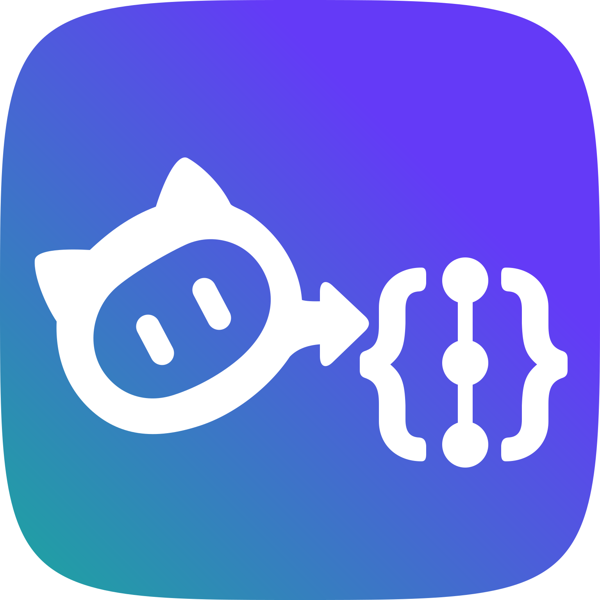

<h1 align="center">
  <br />
  CodeBuddy2API
</h1>

<p align="center">
  将 CodeBuddy 上游服务封装为 OpenAI Chat Completions 与 Anthropic Messages 兼容接口，并提供多用户管理台、API Key、上游凭证隔离和自动轮换能力。
</p>

<p align="center">
  <a href="#本地运行">本地运行</a> ·
  <a href="#docker-部署">Docker 部署</a> ·
  <a href="#开始使用">开始使用</a>
</p>

公网部署面向可信团队，请按[公网部署与安全配置](doc/公网部署与安全配置.md)完成正式账号初始化、关闭默认引导及 HTTPS 反向代理配置，不直接开放后端端口。

## 支持协议

- `POST /openai/v1/responses`：兼容无状态 Responses，支持 Codex CLI 的补丁、命令、图片、客户端 MCP 和历史压缩，配置见 [Codex 接入](doc/Codex接入.md)。
- `POST /openai/v1/chat/completions`：兼容 OpenAI Chat Completions，支持流式和非流式客户端请求。
- 图片 URL、Base64 和多图输入支持原样传递；音频、文件和结构化输出等字段的上游能力另有限制，详见 [Chat Completions 兼容性与多模态验证](doc/协议兼容性.md)。
- `GET /openai/v1/models`：返回当前用户可用的模型列表。
- `POST /anthropic/v1/messages`：兼容 Anthropic Messages wire protocol，支持流式、thinking、图片、文本／图文文档及客户端工具调用；详细限制见[协议兼容性说明](doc/协议兼容性.md)。
- `GET /anthropic/v1/models`：返回供 Claude Code 发现的 `anthropic/codebuddy/<真实模型 ID>` 合成模型列表。
- CodeBuddy 上游只提供流式响应；非流式客户端请求由本服务聚合后返回。

## 本地运行

### 前置要求

- Python 3.10 或更高版本；建议使用 Python 3.12
- 确保你的命令行网络可以访问 GitHub。你也可以选择手动从 [releases](https://github.com/IceeAn/codebuddy2api/releases) 页面下载 `codebuddy2api.zip`，解压并从命令行进入解压后的目录。

### macOS / Linux

1. 获取运行包

> 如果选择手动下载、解压和进入目录，跳过此步骤

```bash
curl -fL -o codebuddy2api.tar.gz https://github.com/iceean/codebuddy2api/releases/latest/download/codebuddy2api.tar.gz
tar -xzf codebuddy2api.tar.gz
cd codebuddy2api
```

2. 启动服务

```bash
python3 -m venv venv
source venv/bin/activate
python3 -m pip install -r requirements.txt

mkdir -p data
python3 web.py
```

真正的全新安装会创建一次性初始账号 `admin` / `admin`。它只在本次启动后的 1 小时内有效，首次登录后会强制修改密码；启动 WARNING 会明确标明正在使用内置默认密码。若不想启用公开的默认值，可在首次启动前运行 `python3 scripts/manage_users.py set-user admin`，隐藏输入两次密码并直接创建正式账号。

启动后访问 `http://127.0.0.1:8001`，继续执行 [开始使用](#开始使用)。

### Windows PowerShell

1. 获取运行包

> 如果选择手动下载、解压和进入目录，跳过此步骤

```powershell
Invoke-WebRequest `
  -Uri "https://github.com/iceean/codebuddy2api/releases/latest/download/codebuddy2api.zip" `
  -OutFile "codebuddy2api.zip"
Expand-Archive -Path "codebuddy2api.zip" -DestinationPath . -Force
Set-Location codebuddy2api
```

2. 启动服务

PowerShell 示例使用 Python Launcher `py -3`。如不可用，可以尝试将 `py -3` 替换为 `python`。

```powershell
py -3 -m venv venv
.\venv\Scripts\python.exe -m pip install -r requirements.txt

New-Item -ItemType Directory -Force data | Out-Null
.\venv\Scripts\python.exe web.py
```

真正的全新安装会创建一次性初始账号 `admin` / `admin`。它只在本次启动后的 1 小时内有效，首次登录后会强制修改密码；启动 WARNING 会明确标明正在使用内置默认密码。若不想启用公开的默认值，可在首次启动前运行 `.\venv\Scripts\python.exe scripts\manage_users.py set-user admin`，隐藏输入两次密码并直接创建正式账号。

启动后访问 `http://127.0.0.1:8001`，继续执行 [开始使用](#开始使用)。

### 更新

> [!NOTE]
> 从使用 `secrets/users.txt`（<= v0.4.0）的旧版本升级时，建议先阅读 [账号系统迁移说明](doc/账号系统迁移.md)，并保留旧文件直到首次迁移成功。

#### 使用更新脚本更新（建议，要求当前安装版本为 v0.2.0 或更高版本）

0.2.0 版本起，Release 包内置更新脚本。更新脚本会在当前项目目录更新，保留 `data`、`secrets`、`.env` 和 Release 管理目录之外的其他文件，默认重新创建 `venv`，并在 `.update-backups/latest` 保存一份完整的更新前备份。

更新前必须退出项目虚拟环境、停止当前服务。如果命令行不能访问 GitHub Releases，你也可以选择下载安装包到本地，并参考下文的“[指定本地文件更新](#use-update-script-with-release-file)”

macOS / Linux：

```bash
# 退出项目虚拟环境
deactivate 2>/dev/null || true

# 更新到最新稳定版
python3 scripts/update_release.py update

# 更新完成后重新启动
source venv/bin/activate
python3 web.py
```

Windows PowerShell：

```powershell
# 退出项目虚拟环境
deactivate

# 更新到最新稳定版
py -3 scripts\update_release.py update

# 更新完成后重新启动
.\venv\Scripts\python.exe web.py
```

如果旧 `venv` 仍然有效，并且希望减少重复安装未变化依赖的时间，可以添加 `--reuse-venv`：

macOS / Linux：

```bash
# 更新到最新稳定版
python3 scripts/update_release.py update --reuse-venv
```

Windows PowerShell：

```powershell
# 更新到最新稳定版
py -3 scripts\update_release.py update --reuse-venv
```

<a id="use-update-script-with-release-file"></a>也可以指定一个更高的稳定版本，或使用已经下载到本机的 Release 文件：

```bash
# 指定远程特定版本更新
python3 scripts/update_release.py update --tag v1.2.3
# 指定本地文件更新
python3 scripts/update_release.py update \
  --release-file ../codebuddy2api.tar.gz
```

```powershell
# 指定远程特定版本更新
py -3 scripts\update_release.py update --tag v1.2.3
# 指定本地文件更新
py -3 scripts\update_release.py update `
  --release-file ..\codebuddy2api-v1.2.3.zip
```

本地文件名必须以 `codebuddy2api` 开头，并以 `.zip` 或 `.tar.gz` 结尾。

交互式运行默认需要输入确认。自动化环境可以添加 `--yes` 或 `-y` 跳过确认。

更新脚本会保留最近一份完整备份用于回滚。若新版启动异常，先再次停止服务并退出虚拟环境，再执行：

```bash
python3 scripts/update_release.py rollback
```

```powershell
py -3 scripts\update_release.py rollback
```

回滚会完整恢复备份时点的代码、数据、配置和虚拟环境，并把回滚前的状态保存为新的 `.update-backups/latest`，因此可以再次执行同一命令撤销回滚。确认新版本长期运行正常后，可以手动删除 `.update-backups` 释放空间。

#### 手动更新

如果当前 Release 中还没有 `scripts/update_release.py`、当前目录是 Git 工作区，或者希望保留旧目录以便直接切换回旧版本，请使用手动更新。不建议把新版 Release 直接解压并覆盖旧目录，也不应把旧版本的 `venv`、程序文件或 `frontend/dist` 复制到新版目录。

1. 从 [Releases](https://github.com/IceeAn/codebuddy2api/releases) 下载目标版本的 `.tar.gz` 或 `.zip`，解压到一个与旧目录分开的新目录。
2. 停止旧服务并退出旧目录的虚拟环境。复制运行中的 SQLite 数据可能得到不一致的文件，因此必须在停止服务后再迁移数据。
3. 将旧目录中的 `data`、`secrets` 和 `.env` 复制到新版目录；如果 `.env` 不存在，可以跳过。项目根目录中其他自行添加的文件不会自动迁移，请按需单独复制，但不要覆盖新版 Release 自带的文件。

macOS / Linux：

```bash
cp -Rp /旧目录/codebuddy2api/data /新版目录/codebuddy2api/
cp -Rp /旧目录/codebuddy2api/secrets /新版目录/codebuddy2api/
cp -p /旧目录/codebuddy2api/.env /新版目录/codebuddy2api/  # .env 存在时执行
```

Windows PowerShell：

```powershell
Copy-Item C:\旧目录\codebuddy2api\data C:\新版目录\codebuddy2api\data -Recurse
Copy-Item C:\旧目录\codebuddy2api\secrets C:\新版目录\codebuddy2api\secrets -Recurse
if (Test-Path C:\旧目录\codebuddy2api\.env) {
  Copy-Item C:\旧目录\codebuddy2api\.env C:\新版目录\codebuddy2api\.env
}
```

4. 在新版目录中重新创建虚拟环境并安装依赖。

macOS / Linux：

```bash
cd /新版目录/codebuddy2api
python3 -m venv venv
source venv/bin/activate
python3 -m pip install -r requirements.txt
python3 web.py
```

Windows PowerShell：

```powershell
Set-Location C:\新版目录\codebuddy2api
py -3 -m venv venv
.\venv\Scripts\python.exe -m pip install -r requirements.txt
.\venv\Scripts\python.exe web.py
```

5. 登录管理台，确认原有用户、凭证、设置和统计数据可用，并实际发起一次请求。确认新版运行正常后，再删除旧目录。

若新版启动或验证失败，先停止新版服务，再从旧目录重新启动旧版本。由于上述流程使用复制而不是移动来迁移数据，验证期间不要同时运行新旧两个版本，也不要让它们继续分别写入各自的数据；否则回到旧版本时，会丢失新版运行期间产生的变更。

## Docker 部署

推荐用 Docker 跑正式服务。本路径只依赖 Docker 和 Docker Compose。

### 1. 获取 Compose 文件

在你准备用于保存部署文件和运行数据的目录中执行：

```bash
curl -fsSL -o docker-compose.yml https://raw.githubusercontent.com/iceean/codebuddy2api/main/docker-compose.yml
```

> 也可以从本仓库的 [docker-compose.yml](docker-compose.yml) 复制内容并手动创建 `docker-compose.yml` 文件。

### 2. 初始化管理台账号

推荐在首次启动前创建一个正式账号：

```bash
mkdir -p data secrets
docker compose run --rm codebuddy2api set-user admin
```

命令会隐藏输入两次密码，并直接写入 `data/codebuddy2api.sqlite3`。`add-user` 是 `set-user` 的完全等价别名。

也可以跳过此步直接启动。真正的全新安装会创建仅在本次启动后 1 小时内有效的 `admin` / `admin` 初始账号，并在首次登录后强制修改密码。

服务运行后可用同一命令新增账号或重置密码，无需重启：

```bash
docker compose run --rm codebuddy2api set-user <用户名>
```

### 3. 启动服务

```bash
docker compose up -d
```

启动后访问 `http://127.0.0.1:8001`，继续执行 [开始使用](#开始使用)。

SQLite、系统账号与 CodeBuddy 凭证都保存在当前目录的 `data` 中。只读 `secrets` 挂载仅用于从旧版 `users.txt` 完成一次性迁移；迁移细节见 [账号系统迁移说明](doc/账号系统迁移.md)。

Compose 默认只发布到宿主回环地址，并启用 `no-new-privileges`；公网访问请遵循[公网部署与安全配置](doc/公网部署与安全配置.md)。其他配置可参考 [.env.example](.env.example)，创建 `.env` 后再启动。

## 开始使用

服务启动后，按此顺序操作：

1. 使用正式账号登录；若使用 `admin` / `admin` 初始账号，按页面要求先修改密码并重新登录。
2. 正式账号以后可在“设置 → 账号安全”修改自身密码。
3. 在“凭证管理”中启动 CodeBuddy 认证并完成官方登录授权，也可以手动添加凭证。
4. 确认凭证列表中至少有一个有效凭证。
5. 在“API 密钥”中创建一个 `sk-...` API Key；请及时复制，明文只会在创建时展示一次。

拿到 API Key 后，可以先用 `curl` 验证：

```bash
curl "http://127.0.0.1:8001/openai/v1/chat/completions" \
  -H "Authorization: Bearer sk-your_api_key" \
  -H "Content-Type: application/json" \
  -d '{
    "model": "glm-5.2",
    "messages": [
      {"role": "user", "content": "你好，2+2 等于几？"}
    ]
  }'
```

把 `sk-your_api_key` 替换为管理台生成的 API Key。

Windows PowerShell 可用以下命令验证：

```powershell
$body = @{
  model = "glm-5.2"
  messages = @(
    @{
      role = "user"
      content = "你好，2+2 等于几？"
    }
  )
} | ConvertTo-Json -Depth 4

Invoke-RestMethod `
  -Uri "http://127.0.0.1:8001/openai/v1/chat/completions" `
  -Method Post `
  -Headers @{ Authorization = "Bearer sk-your_api_key" } `
  -ContentType "application/json" `
  -Body $body
```

## 客户端使用

兼容大部分支持允许自定义端点 URL 且支持 OpenAI Chat Completions 协议的客户端。

手动调用示例如下（须将 `sk-your_api_key` 更换为上文获取的 API Key）：

Python 示例需要另外安装 OpenAI SDK：

```bash
python3 -m pip install openai
```

```python
import openai

client = openai.OpenAI(
    api_key="sk-your_api_key",
    base_url="http://127.0.0.1:8001/openai/v1",
)

# 非流式请求
response = client.chat.completions.create(
    model="glm-5.2",
    messages=[{"role": "user", "content": "你好"}],
)
print(response.choices[0].message.content)

# 流式请求
stream = client.chat.completions.create(
    model="glm-5.2",
    messages=[{"role": "user", "content": "写一个 Python Hello World"}],
    stream=True,
)
for chunk in stream:
    print(chunk.choices[0].delta.content or "", end="")
```

### Anthropic SDK 与 Claude Code

Anthropic 请求必须携带 `anthropic-version: 2023-06-01`，并使用 `x-api-key` 或 `Authorization: Bearer`。两种认证头同时提供时值必须一致。

CodeBuddy 无法报告命中的自定义停止序列，因此非空 `stop_sequences` 会返回 400，避免把截断错误表示为自然结束；缺省或空数组可以正常使用。工具没有输出时，`tool_result.content` 可以省略、传空字符串或空数组。模型列表中的 `created_at` 固定为 Unix epoch，表示网关无法获知 CodeBuddy 模型的真实发布时间。

```bash
curl "http://127.0.0.1:8001/anthropic/v1/messages" \
  -H "x-api-key: sk-your_api_key" \
  -H "anthropic-version: 2023-06-01" \
  -H "content-type: application/json" \
  -d '{
    "model": "glm-5.2",
    "max_tokens": 1024,
    "messages": [{"role": "user", "content": "你好"}]
  }'
```

官方 Python SDK 示例：

```python
import anthropic

client = anthropic.Anthropic(
    api_key="sk-your_api_key",
    base_url="http://127.0.0.1:8001/anthropic",
)
message = client.messages.create(
    model="glm-5.2",
    max_tokens=1024,
    messages=[{"role": "user", "content": "你好"}],
)
print(message.content)
```

Claude Code 推荐配置如下。模型 ID 请以 `GET /anthropic/v1/models` 的实际结果为准：

```bash
export ANTHROPIC_BASE_URL="http://127.0.0.1:8001/anthropic"
export ANTHROPIC_AUTH_TOKEN="此处改成你在 web 端创建的API key"

export ANTHROPIC_MODEL="anthropic/codebuddy/glm-5.3"
export ANTHROPIC_DEFAULT_OPUS_MODEL="anthropic/codebuddy/glm-5.3"
export ANTHROPIC_DEFAULT_SONNET_MODEL="anthropic/codebuddy/glm-5.3"
export ANTHROPIC_DEFAULT_HAIKU_MODEL="anthropic/codebuddy/glm-5.3"
export ANTHROPIC_DEFAULT_FABLE_MODEL="anthropic/codebuddy/glm-5.3"

export CLAUDE_CODE_ATTRIBUTION_HEADER=0
export CLAUDE_CODE_ENABLE_GATEWAY_MODEL_DISCOVERY=1
```

`POST /anthropic/v1/messages/count_tokens` 支持本地输入计数，无需 `max_tokens` 或 CodeBuddy 凭证；纯文本使用 `/tokenizer/v1/count_tokens`。设置页支持上传分词文件及用户模型映射，API 测试页提供对应测试。开发环境首次运行前执行 `python3 scripts/download_tokenizers.py`；Docker 与 Release 包自带离线资源。支持范围、计数精度和可配置限制见 [分词与计数](doc/分词与计数.md)。

## 端点与鉴权边界

| 调用方     | 路径                               | 鉴权方式                | 说明                             |
| ---------- | ---------------------------------- | ----------------------- | -------------------------------- |
| 外部客户端 | `/openai/v1/*`                     | `sk-...` Bearer API Key | 对外 OpenAI 兼容入口             |
| 外部客户端 | `/anthropic/v1/*`                  | `x-api-key` 或 Bearer   | 对外 Anthropic Messages 兼容入口 |
| Web 管理台 | `/auth/*`                          | 公开状态或会话 Cookie   | 初始状态、登录、改密、会话、退出 |
| Web 管理台 | `/api/admin/*`                     | 会话 Cookie             | 凭证、API Key、设置和状态管理    |
| 开发文档   | `/docs`、`/redoc`、`/openapi.json` | 会话 Cookie             | Swagger、ReDoc 与 OpenAPI schema |
| 监控系统   | `GET /health`                      | 无                      | 健康检查                         |

登录管理台后，可从“开发文档”页面的按钮在新标签页打开 `/docs`；也可以在保持登录会话的浏览器中直接访问 `/docs` 或 `/redoc`。未登录请求会返回 401，`sk-...` API Key 不能代替管理台会话访问文档。

一次性初始账号登录后只能访问首次改密所需的前端、`/health`、`/auth/bootstrap-status`、`/auth/login`、`/auth/session`、`/auth/change-password` 和 `/auth/logout`。其他 Cookie 管理接口在完成改密前返回 403；外部 API Key 请求不受影响。

OpenAPI 文档会展示外部 `/openai/v1/*` 和 `/anthropic/v1/*` 的请求体与鉴权。使用 Swagger 调试外部接口时，仍需通过 Authorize 填写管理台生成的 `sk-...` API Key。管理台测试入口 `/api/admin/playground/<协议>/v1/*` 不会出现在 schema 中。

## 统计与隐私

登录管理台后可从独立的“统计”页面查看当前系统用户的请求情况。页面展示请求数、成功率、Token、CodeBuddy credit 消耗、总耗时和首个有效输出耗时，并提供趋势和请求统计明细。 逐请求脱敏明细保留 90 天，UTC 小时汇总永久保留。

统计记录不会保存提示词、回答、请求头、Bearer/CodeBuddy Token、工具参数、原始错误体或会话 ID。

## 配置

配置分为两类：

1. 启动与安全边界配置：环境变量优先于代码默认值，只在服务启动时加载，不从 SQLite 读取。
2. 用户级运行配置：管理台首次保存后按用户名写入 `data/codebuddy2api.sqlite3`；未保存的字段继承对应环境变量或代码默认值。

以下表格反映当前配置；应用根目录下的 `.env` 是可选文件，仅用于覆盖默认值，不会向父目录搜索。

### 启动与安全边界配置

#### 服务启动与存储

| 环境变量                       | 默认值              | 说明                                                                                               |
| ------------------------------ | ------------------- | -------------------------------------------------------------------------------------------------- |
| `CODEBUDDY_USERS_FILE`         | `secrets/users.txt` | 仅用于首次迁移的旧用户文件；缺失对全新安装合法，正式初始化后永久忽略                               |
| `CODEBUDDY_BOOTSTRAP_ENABLED`  | `true`              | 真正全新安装是否创建一次性初始账号；关闭后须用账号管理命令初始化                                   |
| `CODEBUDDY_BOOTSTRAP_USERNAME` | `admin`             | 一次性初始用户名；仅在账号系统尚未初始化时读取                                                     |
| `CODEBUDDY_BOOTSTRAP_PASSWORD` | `admin`             | 一次性初始密码；仅在账号系统尚未初始化时读取，首次登录后必须修改                                   |
| `CODEBUDDY_HOST`               | `127.0.0.1`         | 本地启动监听地址                                                                                   |
| `CODEBUDDY_PORT`               | `8001`              | 本地启动监听端口                                                                                   |
| `CODEBUDDY_DATA_DIR`           | `data`              | 运行数据目录，包含 SQLite 和 `credentials/`；相对路径以应用根目录为基准，Docker 固定为 `/app/data` |
| `CODEBUDDY_LOG_LEVEL`          | `INFO`              | `DEBUG`、`INFO`、`WARNING`、`ERROR` 或 `CRITICAL`                                                  |

`CODEBUDDY_BOOTSTRAP_PASSWORD` 未显式配置时，启动 WARNING 会标明正在使用“内置默认密码”；显式配置时会标明“自定义初始密码”。引导账号每次启动只有 1 小时有效期。密码和账号迁移的完整规则见 [账号系统迁移说明](doc/账号系统迁移.md)。

#### 上游连接安全

| 环境变量                          | 默认值                        | 说明                                                    |
| --------------------------------- | ----------------------------- | ------------------------------------------------------- |
| `CODEBUDDY_API_ENDPOINT`          | `https://copilot.tencent.com` | CodeBuddy 上游；国际站可使用 `https://www.codebuddy.ai` |
| `CODEBUDDY_ALLOWED_API_ENDPOINTS` | 中国站、国际站                | 可接收真实 CodeBuddy Token 的上游白名单                 |
| `CODEBUDDY_SSL_VERIFY`            | `true`                        | 上游 TLS 证书校验；公网部署必须保持开启                 |

#### 后台凭证任务节流

| 环境变量                                                | 默认值 | 说明                                                                                  |
| ------------------------------------------------------- | ------ | ------------------------------------------------------------------------------------- |
| `CODEBUDDY_CREDENTIAL_BACKGROUND_DELAY_MIN_SECONDS`     | `5`    | 周期额度探测和自动签到相邻请求的最小启动间隔秒数                                       |
| `CODEBUDDY_CREDENTIAL_BACKGROUND_DELAY_MAX_SECONDS`     | `20`   | 周期额度探测和自动签到相邻请求的最大启动间隔秒数；两类任务分别节流，不互相等待         |

两项配置接受非负有限整数或小数，最小值不得大于最大值；相等时使用固定间隔，均为 `0` 时关闭节流。每小时额度扫描与定时/补偿签到会使用该随机区间；应用启动首轮额度扫描、添加凭证、OAuth 保存、账号切换、手动签到及签到后的额度重探测保持即时。

#### HTTP 与浏览器安全

| 环境变量                        | 默认值                | 说明                                                         |
| ------------------------------- | --------------------- | ------------------------------------------------------------ |
| `CODEBUDDY_ALLOWED_HOSTS`       | `localhost,127.0.0.1` | 允许访问本服务的 Host 头                                     |
| `CODEBUDDY_PUBLIC_ORIGIN`      | 空                    | 公网浏览器唯一 HTTPS 来源；启用后强制校验安全配置并设置 Secure Cookie |
| `FORWARDED_ALLOW_IPS`          | `127.0.0.1`           | 可信代理 IP/CIDR，须匹配实际连接来源；公网模式禁止通配或全地址范围 |
| `CODEBUDDY_ALLOWED_ORIGINS`     | 空                    | 仅允许跨域访问外部 API Key 协议入口的 Origin；不放行管理台 |
| `CODEBUDDY_CSP_FRAME_ANCESTORS` | `none`                | CSP 页面嵌入来源；支持 `self` 与空格分隔的 HTTP/HTTPS Origin |

管理台写操作必须携带同源 Origin，缺失时才回退到同源 Referer；缺失来源、`null` 和同站异源均拒绝。playground 必须使用 `application/json`。外部 API Key 入口不要求浏览器来源。

#### 登录与容量保护

| 环境变量                                | 默认值     | 说明                                                         |
| --------------------------------------- | ---------- | ------------------------------------------------------------ |
| `CODEBUDDY_MAX_REQUEST_BODY_BYTES`      | `16777216` | 全局 HTTP 请求体上限；登录和改密接口另有固定 8 KiB 上限      |
| `CODEBUDDY_REQUEST_BODY_TIMEOUT_SECONDS` | `30`     | 应用读取请求体的总期限，不主动读取端点未消费的流             |
| `CODEBUDDY_UPSTREAM_TIMEOUT_SECONDS`   | `1800`     | 上游聊天总期限，覆盖重试、持续心跳及流式发送                 |
| `CODEBUDDY_MAX_SSE_LINE_BYTES`         | `1048576`  | 单行 SSE 字节上限                                           |
| `CODEBUDDY_MAX_UPSTREAM_RESPONSE_BYTES` | `33554432` | 累计上游响应字节上限                                       |
| `CODEBUDDY_MAX_UPSTREAM_ERROR_BYTES`   | `65536`    | 上游错误响应体字节上限                                      |
| `CODEBUDDY_LOGIN_RATE_WINDOW_SECONDS`   | `60`       | 登录/改密全局、IP、用户名三个独立速率桶共用的滑动窗口秒数    |
| `CODEBUDDY_LOGIN_GLOBAL_MAX_ATTEMPTS`   | `60`       | 每个登录限流窗口允许的进程全局尝试数                         |
| `CODEBUDDY_LOGIN_IP_MAX_ATTEMPTS`       | `10`       | 每个登录限流窗口允许的单一客户端 IP 尝试数                   |
| `CODEBUDDY_LOGIN_USERNAME_MAX_ATTEMPTS` | `5`        | 每个登录限流窗口允许的单一用户名尝试数                       |
| `CODEBUDDY_LOGIN_MAX_CONCURRENCY`       | `2`        | 同时进入线程池的登录/改密 PBKDF2 校验数；超限不排队          |
| `CODEBUDDY_MAX_CONCURRENT_REQUESTS`     | 空         | Uvicorn 与应用完整响应生命周期并发上限；公网模式必须设置正整数 |

`CODEBUDDY_API_ENDPOINT`、白名单 URL 或其他强类型配置无效时，服务会在启动阶段直接失败；不会回退到其他站点，也不会把真实 Token 转发到未明确授权的地址。

### 用户级运行配置

| 环境变量默认值                             | 默认值                                                 | 说明                             |
|-------------------------------------|-----------------------------------------------------|--------------------------------|
| `CODEBUDDY_MODELS`                  | `glm-5.2,deepseek-v4-pro`                           | 与 CodeBuddy 动态模型列表合并的附加模型      |
| `CODEBUDDY_CODEX_AUTO_REVIEW_MODEL` | `deepseek-v4-flash` | codex-auto-review 的默认真实模型，用户可在服务配置中覆盖 |
| `CODEBUDDY_FORCED_REASONING_MODELS` | `deepseek-v4-pro,deepseek-v4-flash,glm-5.1,glm-5.2` | 强制启用最大推理参数的模型；空表示关闭            |
| `CODEBUDDY_FORCED_TEMPERATURE`      | `1`                                                 | 强制覆盖 `temperature`；空表示保留客户端值   |
| `CODEBUDDY_STRIP_MODEL_NAMESPACE`   | `true`                                              | 将 `provider/model` 转换为 `model` |
| `CODEBUDDY_AUTO_ROTATION_ENABLED`   | `true`                                              | 是否自动轮换 CodeBuddy 凭证            |
| `CODEBUDDY_AUTO_CHECKIN_ENABLED`    | `false`                                             | 是否在每天服务器时间 09:30 为有效个人版凭证自动签到  |
| `CODEBUDDY_ROTATION_COUNT`          | `1`                                                 | 每 N 次请求切换凭证，必须为正整数             |

## 架构概览

```text
OpenAI 客户端 ── /openai/v1 + API Key ──> Chat Completions 适配 ─┐
Codex CLI ───── /openai/v1 + API Key ──> Responses 适配 ────────┤
                                                                ├─> 共享请求策略、凭证与上游流传输 ─> CodeBuddy
Anthropic 客户端 ─ /anthropic/v1 + API Key ─> Messages 请求/响应适配 ┘

管理台 playground 使用对应 `/api/admin/playground/<协议>/v1` 路径和会话 Cookie，复用同一执行流程。
```

主要职责边界：

- `web.py`：FastAPI 组装、路由挂载和 Uvicorn 本地入口。
- `config.py`：启动配置、用户级设置及其持久化。
- `src/auth_*.py`、`src/*_store.py`：系统用户、会话和 API Key。
- `src/responses_request.py`、`src/responses_response.py`：Responses 请求转换、工具包装和流式生命周期。
- `src/openai_router.py`、`src/openai_compat.py`：OpenAI 协议入口和响应兼容。
- `src/anthropic_router.py`、`src/anthropic_compat.py`、`src/anthropic_response.py`：Anthropic 认证、请求转换与响应状态机。
- `src/codebuddy_events.py`、`src/chat_execution.py`：协议中立的上游事件与共享聊天执行流程。
- `src/codebuddy_*.py`、`src/credential_*.py`：CodeBuddy OAuth、凭证存储与轮换。
- `src/stream_service.py`、`src/sse.py`：上游流式请求、SSE 解析和非流式聚合。
- `src/usage_stats_*.py`、`src/stats_router.py`：脱敏统计采集、SQLite 持久化、聚合查询与管理接口。
- `frontend/`：Vue 管理台源码、构建产物和公共静态资源。

## 开发、本地构建与验证

### 后端开发运行

```bash
python3 -m venv venv
source venv/bin/activate
python3 -m pip install -r requirements-dev.txt
python3 scripts/download_tokenizers.py

mkdir -p data
python3 scripts/manage_users.py set-user admin
python3 web.py
```

### 前端开发运行

前端开发和构建要求 Node.js 24.15+ 与 pnpm 10.29+。

前端开发服务器会把 `/auth`、`/api`、`/codebuddy`、`/openai`、`/anthropic`、`/health`、`/docs`、`/redoc` 和 `/openapi.json` 代理到本地后端 `127.0.0.1:8001`。

```bash
cd frontend
pnpm install --frozen-lockfile
pnpm run dev
```

### 本地构建 Docker 镜像

在源码目录中构建本地镜像：

```bash
docker build -t codebuddy2api:local .
```

可复用 [Docker 部署](#docker-部署) 中创建的 `data` 启动本地镜像；`secrets` 只为兼容旧用户文件迁移而只读挂载：

```bash
docker run -d \
  --name codebuddy2api-local \
  --restart unless-stopped \
  -p 8001:8001 \
  -v "$PWD/data:/app/data" \
  -v "$PWD/secrets:/app/secrets:ro" \
  codebuddy2api:local
```

### 验证

后端使用标准库 `unittest` 和 `coverage.py`，对 `config.py`、`web.py`、`src/` 强制执行行/分支综合 100% 覆盖率：

```bash
source venv/bin/activate
python3 -m coverage run -m unittest discover -s tests
python3 -m coverage report
```

前端修改后按以下顺序验证：

```bash
cd frontend
pnpm run format:check
pnpm run lint
pnpm run build
pnpm run test:coverage
```

## 故障排除

#### `检测到既有安装但没有可迁移的旧用户文件`

这是为了避免在旧安装中意外启用公开的 `admin/admin`。恢复旧 `users.txt` 后重新启动，或使用同一数据目录运行 `scripts/manage_users.py set-user <用户名>` 创建正式账号；Docker 使用 `docker compose run --rm codebuddy2api set-user <用户名>`。

#### `初始账号已过期`

未完成首次改密的一次性引导账号已超过本次启动的 1 小时有效期。重启服务获得新的 1 小时窗口，登录后立即完成改密；也可用 `manage_users.py set-user` 直接把账号设为正式账号。

#### `Invalid authentication credentials`

- 外部客户端必须请求 `/openai/v1/*` 并发送 `Authorization: Bearer sk-...`。
- Anthropic 客户端必须请求 `/anthropic/v1/*`，发送 `x-api-key` 或 Bearer API Key，并带 `anthropic-version: 2023-06-01`。
- 管理台测试请求必须访问 `/api/admin/playground/<协议>/v1/*` 并携带有效会话 Cookie。
- API Key 所属系统账号从 SQLite 删除后，该 Key 会暂时失效；重建同名账号后会恢复可用。

#### `凭证获取失败` 或没有可用模型

当前系统用户没有可用的 CodeBuddy 上游凭证。登录管理台重新认证、添加凭证，并使用凭证测试功能确认状态。

#### `CodeBuddy API error: 401` 或 `403`

这是上游 CodeBuddy 拒绝凭证，不是本系统 API Key 失效。重新完成 CodeBuddy 认证或替换上游凭证。

#### `Invalid host header`

把实际访问域名加入 `CODEBUDDY_ALLOWED_HOSTS` 后重启服务。

#### 查看详细日志

设置 `CODEBUDDY_LOG_LEVEL=DEBUG` 后重启服务。日志可能包含请求元数据，不要在公开场合直接粘贴完整日志。

## 授权协议

本仓库当前的源代码基于 MIT 许可证授权。

本仓库是无任何开源协议授权的上游项目 [xueyue33/codebuddy2api](https://github.com/xueyue33/codebuddy2api) 的一个 fork，并保留了原始 Git 提交历史，以用于署名和透明性说明。MIT 许可证仅适用于该 fork 维护者在当前工作区中独立重写的代码。该许可证不适用于历史提交、原上游项目代码，或任何可能出现在 Git 历史中的第三方材料。具体信息可参考 [LICENSING.md](LICENSING.md)。
